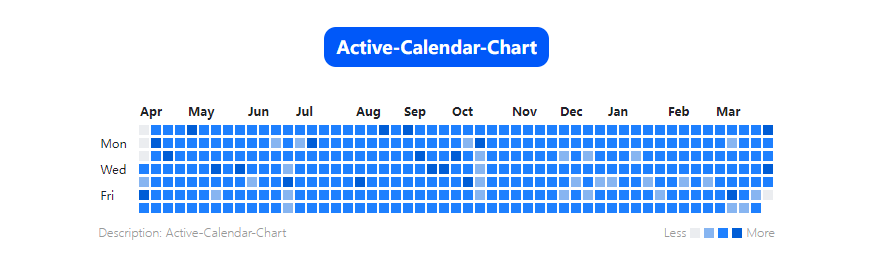
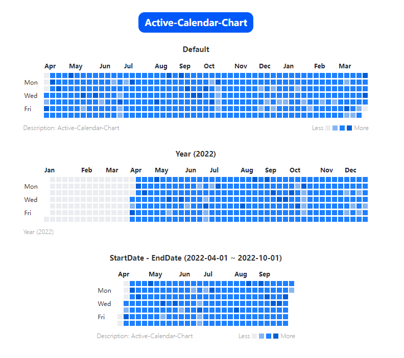

# Active-Calendar-Chart

contribution calendar component like github (based on vue)

**English** | [简体中文](./README.zh-CN.md)

## Install

`npm install active-calendar-chart`

## Component Props

| Prop          | Description               | Type                                              | Default                            | Required |
| ------------- | ------------------------- | ------------------------------------------------- | ---------------------------------- | -------- |
| value         | datasource                | `{[key:string]: { value: number; color: string}}` | `{}`                               | No      |
| text-align    | textAlign                 | `left \| right \| center`                         | `left`                             | No       |
| date          | date value                | `number \| { start: string; end: string }`        | `undefined`                        | No       |
| default-color | set grid default color    | `string`                                          | `#ebedf0`                          | No       |
| less          | less text                 | `string`                                          | `less`                             | No       |
| more          | more text                 | `string`                                          | `more`                             | No       |
| colors        | color range               | `string[]`                                        | `[]`                               | No       |
| grid          | set grid width and height | `{ width: string; height: string }`               | `{ width: '10px', height: '10px'}` | No       |
| description   | set chart description     | `string`                                          | `undefined`                        | No       |

## Component Slots

| Name       | Description                   |
| ---------- | ----------------------------- |
| default    | customize default content.    |
| first-grid | customize first grid content. |
| month      | customize month grid content. |
| week       | customize week grid content.  |

## Usage

### Use component

#### Global Registration

```ts
import ActiveCalendarChart from 'active-calendar-chart'
app.use(ActiveCalendarChart)
```

#### Local Registration

```html
<script setup>
  import ActiveCalendarChart from 'active-calendar-chart'
  // import { ActiveCalendarChart } from 'active-calendar-chart'
  const data = ref({
    '2023-04-05': {
      color: '#005dd6',
      value: 5.19,
    },
    '2023-04-04': {
      color: '#1e80ff',
      value: 5.19,
    },
    '2023-04-03': {
      color: '#1e80ff',
      value: 5.2,
    },
    //   ...
  })
</script>
<template>
  <!-- default -->
  <ActiveCalendarChart :value="data" />
  <!-- set year -->
  <ActiveCalendarChart :date="2022" :value="data" />
  <!-- set date range -->
  <ActiveCalendarChart
    :date="{ start: '2022-04-01', end: '2022-10-10' }"
    :value="data"
  />
</template>
```

### Demo Preview



### Get generated data

Custom ui

```ts
// generate data
import { generateChartData } from 'active-calendar-chart'
// default
console.log(generateChartData())
// set year
console.log(generateChartData(2023))
// set date range
console.log(generateChartData('2022-04-01', '2022-10-08'))
```
